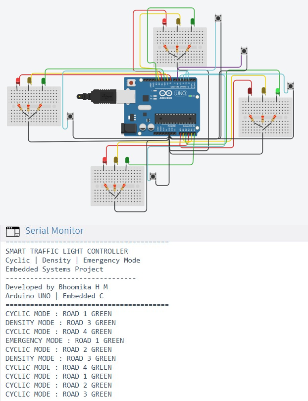

# Smart Traffic Light Controller 🚦

## 📌 Overview
This project implements a smart traffic signal system using Arduino UNO.  
It supports multiple control modes like cyclic operation, density-based control, and emergency override.

## ⚙️ Features
- Cyclic traffic signal operation
- Density-based control using input buttons
- Emergency vehicle override mode
- Finite State Machine (FSM) based logic
- Non-blocking timing using millis()

## 🛠️ Technologies Used
- Arduino UNO
- Embedded C
- Tinkercad Simulation

## 🔌 Components
- LEDs (Red, Yellow, Green)
- Push Buttons
- Resistors

## ▶️ Working
- GREEN → YELLOW → RED  
- RED → RED+YELLOW → GREEN  

## 📷 Circuit Diagram

## 📁 Files
- traffic_controller.ino
- Traffic_Controller.png
- smart traffic light controller.pdf

## 📈 Future Improvements
- IoT-based monitoring
- AI-based traffic control

## 👩‍💻 Author
Bhoomika H M
